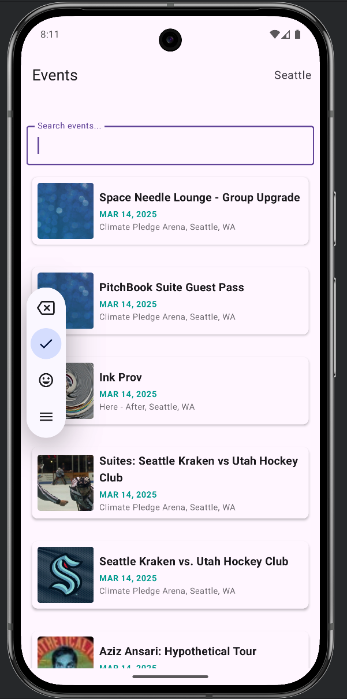
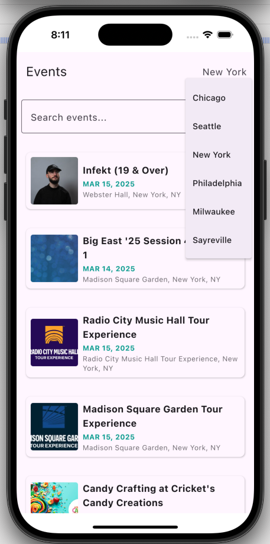

# Ticketmaster Events App

A Kotlin Multiplatform (KMP) application for browsing events from the Ticketmaster API, built with Jetpack Compose for Android and supporting offline caching with Room.

## Overview

This app fetches and displays events for a given city, allowing users to browse paginated event lists, filter by search queries, and view event details. It’s designed to work across Android and  iOS using shared business logic and platform-specific implementations for networking and UI.

- **Current Platforms**: Android and iOS
- **Key Features**:
    - Event listing with pagination
    - Search filtering by event name and location
    - Offline support via Room database
    - City-based event retrieval

## Prerequisites

- **Android Studio**: Latest stable version (e.g., Koala | 2024.1.1 or later)
- **JDK**: 17 or higher
- **Kotlin**: 2.1.0
- **Gradle**: 8.10.2 (compatible with wrapper)

## Tech Stack
- **Kotlin Multiplatform (KMP):** Shared code for Android and iOS.
- **Jetpack Compose:** Declarative UI framework for both platforms.
- **Koin:** Dependency injection for managing components.
- **Room:** Configured local database (not yet used in code).
- **Ktor:** Networking for real API calls.
- **Coil:** Image loading for post images.
- **Coroutines & Flow:** Asynchronous programming and state management.
- **Mockative:** Kotlin Native test framework.

## Key Components

- **AppViewModel**: Manages UI state, pagination, and search filtering.
- **GetEventsUseCase**: Fetches events and maps errors to user-friendly messages.
- **AppRepositoryImpl**: Combines network and local data sources with caching.
- **NetworkRemoteDataSource**: Calls the Ticketmaster API via Ktor HttpClient.
- **DbDataSource & EventDao**: Handles local storage with Room.
- **Event**: Data model with API-to-local mapping and date formatting.


## Architecture

- **Presentation Layer**: Jetpack Compose UI with `AppViewModel` using Kotlin Flows.
- **Domain Layer**: Use cases (e.g., `GetEventsUseCase`) for business logic.
- **Data Layer**:
  - `AppRepository` interface and `AppRepositoryImpl` for data orchestration.
  - `RemoteDataSource` (network) and `LocalDataSource` (database) implementations.
- **Networking**: Ktor `HttpClient` (platform-specific: Android uses CIO, iOS uses Darwin).
- **Database**: Room with an in-memory option for testing.
- **Error Handling**: `Either` type for success/failure states, with mapped error messages.

## Setup Instructions

### Common
**Clone the Repository**:

   ```bash
   git clone git@github.com:andreBurnt/Funster.git
   ```

**Configure API Key:**

Obtain a Ticketmaster API key from developer.ticketmaster.com.

Add it to the BuildConfig in ./composeApp/build.gradle.kts

    ```
    buildConfig {
      useKotlinOutput { internalVisibility = true }
      buildConfigField("API_BASE_URL", "https://app.ticketmaster.com/discovery/v2")
      buildConfigField("API_TOKEN", "1234567890")
    }
    ```

### Android
1. Open the project in Android Studio.
2. Sync the Gradle files (File > Sync Project with Gradle Files).
3. Build and run the app on an emulator or device (Run > Run 'composeApp').

### iOS
1. Open iosApp/iosApp.xcodeproj in Xcode.
2. Ensure the Kotlin Multiplatform plugin is installed in Android Studio (for syncing shared code).
3. Build and run the app on a simulator or device (Product > Run).

## Project Structure

```
Funster/
├── composeApp/              # Main app module (KMP)
│   ├── src/
│   │   ├── androidMain/    # Android-specific code (e.g., HttpClient)
│   │   ├── commonMain/     # Shared code across platforms
│   │   │   ├── co/funster/app/
│   │   │   │   ├── core/   # Models, ViewModel, UI state
│   │   │   │   ├── data/   # Repository implementation
│   │   │   │   ├── db/     # Room database and DAO
│   │   │   │   ├── domain/ # Use cases
│   │   │   │   └── network/# Network data source
│   │   ├── commonTest/     # Shared unit tests
│   │   └── androidTest/    # Android-specific tests (e.g., Room)
│   └── build.gradle.kts    # Module build configuration
└── README.md               # This file
```


## Usage
Open the app to view the events. Change the city to view events in other cities.
Pull up to reload the events. Scroll down to load new events.

## Screenshots



## Known Bugs
1. If the user scrolls down fast, the next events page is not loading.

## Limitations
iOS UI relies on SwiftUI integration, which may differ slightly from Android’s Compose UI.

Testing Multiplatform Composable UI is blocked due to a bug https://slack-chats.kotlinlang.org/t/18784429/hi-there-i-m-trying-to-run-an-ui-test-in-shared-commontest-a
TODO: find a workaround, monitor updates to https://www.jetbrains.com/help/kotlin-multiplatform-dev/compose-test.html

Previews in Android Studio are limited to androidMain, but our composables are commonMain https://github.com/JetBrains/compose-multiplatform/issues/4869

**Note**: Testing UI using Android Espresso in Android app for now.

## Future Improvements
1. Improve UX!
2. Add ability to view event details
3. Enable proguard for release and configure proguard rules
4. Inline Functions: Investigate and implement inline functions in performance-critical areas (e.g., state updates in AppViewModel.kt) to reduce overhead.
5. Break composeApp into separate Gradle modules (e.g., :core, :data, :domain, :presentation) for better modularity.
6. Use device location to show nearby events instead of a list of cities.
7. Allow user to select a location to search for events. Validate the location using 3rd service (e.g. Google Address Validation API).
8. UI End-to-end tests (Android Espresso, XCTest). Configure end-to-end tests for Kotlin multiplatform for Compose UI (add test tags).
9. Add Compose preview components to display UI changes in Android Studio.
10. Move API secrets to a local file (e.g. secrets.properties) and configure token injection to BuildConfig or to SecureSettings.
11. Add string translations for i18n.

## Ideas Parking Lot
1. Prototype with Android Instant app.

## Contributing
This is a sample project.

## License
This project is unlicensed and intended for educational purposes only.

